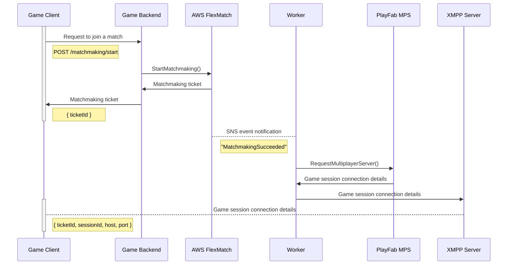

# AWS FlexMatch + PlayFab MPS

## Architectural Overview

### FlexMatch

This is a matchmaking service provided by AWS that is often paired with GameLift, but can also be used
as a standalone service.  FlexMatch is designed to be highly customizable and can be used to match players based on a
wide variety of custom criteria, such as player skill, player latency, and player preferences, without requiring
developers to write application code.

[AWS FlexMatch](https://docs.aws.amazon.com/gamelift/latest/flexmatchguide/match-intro.html)

### PlayFab MPS

This is a compute platform that allows game developers to run game servers in the cloud without having to manage any
infrastructure. Each game session is a containerized, dedicated instance of a game server that is created and managed by
PlayFab MPS.

[PlayFab Multiplayer Servers](https://learn.microsoft.com/en-us/gaming/playfab/features/multiplayer/servers/)

### Worker Lambda

This is a worker Lambda function that receives event notifications from FlexMatch (via an SNS topic) about matchmaking
transactions. When a match is found, the worker [requests a game server from PlayFab MPS](https://learn.microsoft.com/en-us/rest/api/playfab/multiplayer/multiplayer-server/request-multiplayer-server?view=playfab-rest) and forwards the server connection details to both players via XMPP.

## How It Works

## Potential Bottlenecks

### FlexMatch

- Lambda cold start times

### PlayFab MPS

- Insufficient capacity (i.e., not enough standby servers)
