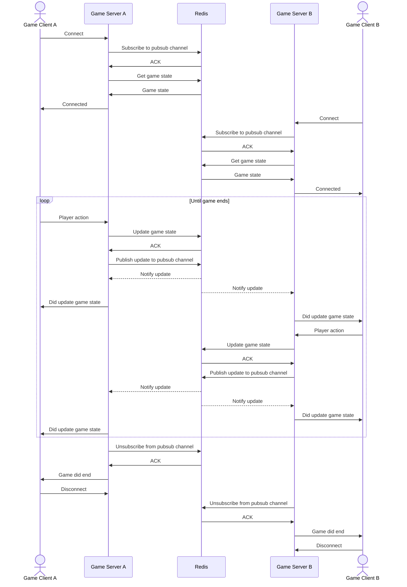

# Migrating to Serverless Infrastructure: Architecture Overview, Challenges, and Implementation Strategy

## Introduction

This document outlines:

- The current architecture of the game server
- The challenges and limitations of the current setup
- A strategy to migrate the architecture to serverless infrastructure

---

## Current Architecture

- Linux process written in Unity; architecture is x86_64
- Communicates with clients via UDP (Unity Netcode)
- Hosts multiple game sessions on a single, long-lived process
  - Each game session is a match between two players
  - Game session state resides in an in-memory data structure on the game server process. That means two players in the
    same match *must* connect to the same game server process.

- Resource utilization at rest (i.e., while hosting no game sessions)
  - CPU: 8% of a single CPU core (Intel(R) Xeon(R) Platinum 8259CL CPU @ 2.50GHz)
  - Memory: 267 MB resident

- It is estimated that a single game server process could host upwards of 40 game sessions on a single vCPU core when
  running this way

- It takes about 15 seconds for the process to enter a state of readiness to accept connections.
---

## Problem Space

### Process Execution Model of Major Hosting Services

Major hosting services, like [GameLift](https://aws.amazon.com/gamelift/) and [PlayFab](https://playfab.com/), have a process execution model that dedicates a single server process to a single game session. That is to say, a dedicated game server process is allocated exclusively for
a single game session, and when the game ends, the process goes away. According to this model, we'd be able to fit on a box with 2 GB RAM about 6 to 7 concurrent game sessions (or 12 to 14 players), given the server's memory footprint. This is not an efficient use of resources, and we would be paying more than we should per game session.

---

## Serverless Hosting on ECS Fargate

- Each game server process runs in an [ECS Fargate](https://docs.aws.amazon.com/AmazonECS/latest/developerguide/AWS_Fargate.html) container.
- Autoscaling policies scale out the number of containers with increasing resource utilization and number of connected players.
- We can also vertically scale the containers by increasing the number of vCPUs and memory allocated to each container, allowing more players to connect to a single process.
- Game clients connect to the game via TCP through an OSI Layer 4 network load balancer. The load balancer then directs the connection to an ECS container. Once connected, the client and server keep the TCP connection open for the entirety of the game session.
- Game state (the state of a single match) no longer resides in-process. Instead, it resides in Redis and can be accessed by any game server process.
- Game server processes subscribe to and publish updates to match-specific Redis pubsub channels to communicate with each other.
- Whenever a player takes an action, the game server process updates the game state in Redis and publishes the update to a Redis pubsub channel, notifying all subscribers.
- The game server exposes an HTTP health check endpoint so that the load balancer can avoid overloading a single container with too many client connections.

### Game Session Activity Sequence

### Implementation Requirements

**Move game state out of the game server process and into Redis.** As long as the game state resides in the game server
process, we will have to send both participants of a match to the same process. This is not compatible with load balancing.

**Use Redis Pub/Sub for inter-server communication.** When a player takes an action, the connected game server process
needs to publish a notification to a Redis pubsub channel. This way, the other player's game server process is notified
of the action, enabling timely UI updates to the opposing player.

**Allow the load balancer to interrogate a game server's health.** The game server must expose an HTTP interface
for a load balancer to check the health of the process. This way, the load balancer can route new
connections to containers that aren't already under too much load.

### Unknowns

- Will UDP-based Unity Netcode work for us? Or do we have to switch to a persistent TCP socket? [Mirror](https://mirror-networking.gitbook.io/docs) with [Telepathy](https://mirror-networking.gitbook.io/docs/manual/transports/telepathy-transport) for example.

---

## Cost Estimates

### ECS Fargate + Redis

**Assumptions**

- Fargate compute cost is `$0.04048` per vCPU per hour, in `us-west-2`
  [source](https://aws.amazon.com/fargate/pricing/)
- vCPU Requirements:
  - We are confident we can host at least 40 game sessions on a single vCPU core. But for the sake of this exercise,
    let's assume we can only host 20 game sessions per vCPU.
  - Since 1 vCPU core hosts 20 concurrent game sessions, to run 1,000 concurrent game sessions, we need
    1,000 sessions / 20 sessions per vCPU = 50 vCPUs
- Each game session takes up 1 MB of storage after serialization

**Cost Calculation**:
- Fargate
  - 50 vCPUs * $0.04048 per vCPU per hour = $2.024 per hour
  - $2.024 per hour * 24 hours = $48.576 per day
  - $48.576 per day * 30 days = $1,457.28 per month
- Single node Redis Cluster with one replica for high availability, `cache.m6g.xlarge` , 67% utilization
  - 1,000 concurrent game sessions * 1 MB per session = 1,000 MB of storage
  - A single ElastiCache for Redis node of type `cache.m6g.xlarge` has over 12 GB of memory -- more than plenty. Let's
    say we go with one node, plus a replica for high availability
  - Monthly cost of this setup is: $290.53
- Total Monthly Cost: $1,747.81

### PlayFab

See screenshot taken from the [PlayFab MPS pricing estimator](https://playfab.com/mps-calculator/)

**Cost Calculation**:

### Players
- Maximum and average concurrent players: 2,000

### Game Server Configuration

- **Players per game server**: 2
- **Game servers per virtual machine (VM)**: 12
- **vCPUs per VM**: 2
- **Standby % of total servers**: 10%
- **Network egress per player**: 0.1 Mbps

### Virtual Machines
- **Region**: US East
- **VM Series**: Dasv4
- **Operating System**: Linux
- **Hourly rate per VM**: $0.10

### Servers Layout
- **Active servers (average/peak)**: 1,000
- **Standby servers**: 100
- **Total game servers**: 1,100
- **Total virtual machines**: 92

### Usage Estimator
- **Core hours (daily)**: 4,416
- **Core hours (monthly)**: 132,480

### Costs Estimator
- **Compute costs (daily)**: $221.46
- **Compute costs (monthly)**: $6,643.87
