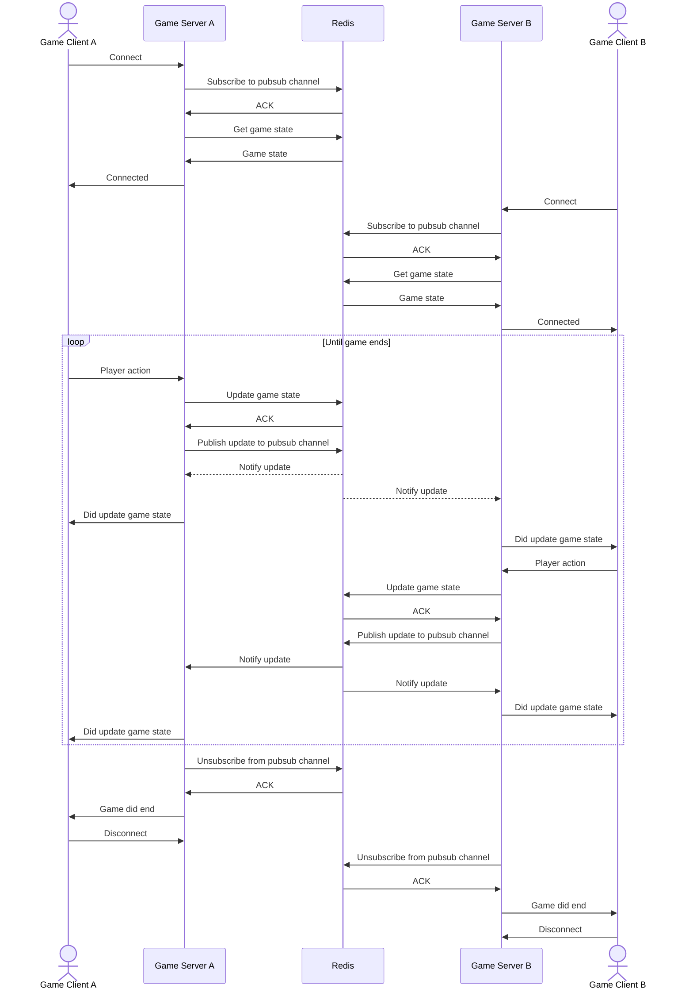
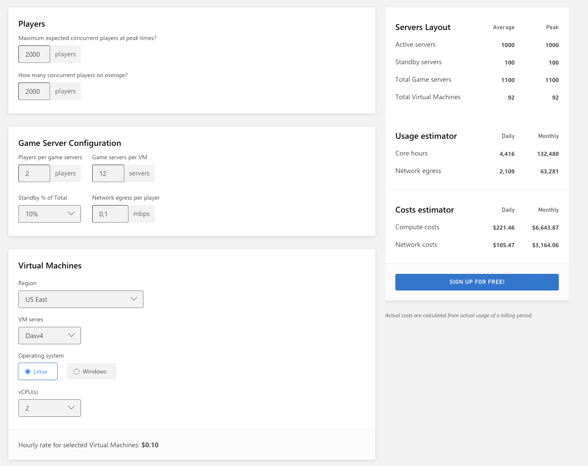

## Introduction

This document outlines:

- The current architecture of the MOTU game server
- The challenges and limitations of the current setup
- A strategy to migrate the architecture to serverless infrastructure

## Current Architecture

```
+-----------+  UDP  +--------------------------------------------+  UDP  +-----------+
| Player A  | <---> |           Game Server Process (Linux)      | <---> | Player B  |
|           |       |                                            |       |           |
|           |       |  +--------------------------------------+  |       |           |
+-----------+       |  |     Shared Memory (Multiple Sessions)  |  |       +-----------+
                    |  |                                        |  |
                    |  |  - Game Session 1 (Player A vs. B)     |  |
                    |  |  - Game Session 2 (Player C vs. D)     |  |
                    |  |  - Game Session 3 (Player E vs. F)     |  |
                    |  +--------------------------------------+  |
                    +--------------------------------------------+
```

- Linux process written in Unity, x86_64 architecture
- Communicates with clients via UDP (Unity Netcode)
- Hosts multiple game sessions on a single process
  - Each game session is a match between two players
  - Game session state resides in an in-memory data structure on the game server process
- It is estimated that a single game server process could host upwards of 40 game sessions on a single vCPU core when
  running this way

- Resource utilization at rest (i.e., while hosting no game sessions)
  - CPU: 8% of a single vCPU core (reference Intel(R) Xeon(R) Platinum 8259CL CPU @ 2.50GHz)
  - Memory: 267 MB resident

Since game sessions reside in-memory, two players of the same match *must* connect to the same game server process.

## Challenges and Limitations of the Current Architecture

### Process Execution Model of Major Hosting Services

Major hosting services, like GameLift and PlayFab, have a process execution model that dedicates a single server process to a single game session. That is to say, the services spin up a dedicated game server process having a lifecycle is tied to the game session. On a box with 2 GB RAM, we'd be able to fit, 6 to 7 concurrent game sessions (or 12 to 14 players), given the server's memory footprint. This is not an efficient use of resources, and we would be paying more than we should per game session.

## Strategy for Migrating to Serverless Infrastructure


### How would hosting on ECS Fargate look like?


- Each game server process runs in an ECS Fargate container.
- As the number of players connected to the game increases, so too do the number of containers, due to autoscaling
policies that add or remove containers based on the number of connected players.
- We can also vertically scale the containers by increasing the number of vCPUs and memory allocated to each container. This would allow us to host more game sessions on a single container.
- Game clients connect via TCP to an network load balancer (OSI Layer 4) that forwards connections to a container that is not under heavy load. The client and server maintain a *persistent connection throughout the life of the game session*.
- Game session state, instead of living in the game server process, resides in Redis and can be accessed by any game server process
- Game server processes subscribe to and publish updates to match-specific Redis pubsub channels to communicate with each other
- The game server exposes an HTTP health check endpoint so that the load balancer is able to route connections to a container that is not under heavy load
- Whenever a player takes an action, the game server process updates the game state in Redis, and publishes the update to a Redis pubsub channel, notifying all subscribers


### Game Session Activity Sequence


### Architectural Changes Required to Migrate to Serverless Infrastructure

1. Replace UDP-based Unity Netcode with a TCP-based persistent connection
1. Move game state out of the game server process and into Redis
1. Game server processes dispatch events to Redis pubsub channels to communicate with each other
1. Game server process must implement an HTTP health check endpoint so that the load balancer can route connections to 
  a container that is not under heavy load

## Cost Analysis

### ECS Fargate

**Assumptions**

- Fargate compute cost is `$0.04048` per vCPU per hour, in `us-west-2`
- vCPU Requirements:
  - We are confident we can host at least 40 game sessions on a single vCPU core. But for the sake of this exercise,
    let's assume we can only host 20 game sessions per vCPU.
  - Since 1 vCPU core can host 20 game sessions, to run 1,000 game sessions, we need 1,000 sessions / 20 sessions per vCPU = 50 vCPUs

**Cost Calculation**:
- vCPU Hourly Cost
  - 50 vCPUs * $0.04048 per vCPU per hour = $2.024 per hour
- Daily Compute Cost
  - $2.024 per hour * 24 hours = $48.576 per day
- Monthly Compute Cost (30 days)
  - $48.576 per day * 30 = $1,457.28

- Monthly Network Egress Cost is calculated using Amazon's [standard rates](https://aws.amazon.com/ec2/pricing/on-demand/#Data_Transfer)

### PlayFab

See screenshot below:



**Cost Calculation**:

### Players
- **Maximum and average concurrent players**: 2,000

### Game Server Configuration

- **Players per game server**: 2
- **Game servers per virtual machine (VM)**: 12
- **vCPUs per VM**: 2
- **Standby % of total servers**: 10%
- **Network egress per player**: 0.1 Mbps

### Virtual Machines
- **Region**: US East
- **VM Series**: Dasv4
- **Operating System**: Linux
- **Hourly rate per VM**: $0.10

### Servers Layout
- **Active servers (average/peak)**: 1,000
- **Standby servers**: 100
- **Total game servers**: 1,100
- **Total virtual machines**: 92

### Usage Estimator
- **Core hours (daily)**: 4,416
- **Core hours (monthly)**: 132,480
- **Network egress (daily)**: 2,109 Mbps
- **Network egress (monthly)**: 63,281 Mbps

### Costs Estimator
- **Compute costs (daily)**: $221.46
- **Compute costs (monthly)**: $6,643.87
- **Network costs (daily)**: $105.47
- **Network costs (monthly)**: $3,164.06

The estimated monthly cost for this setup would be **$6,643.87**, only for compute costs.
